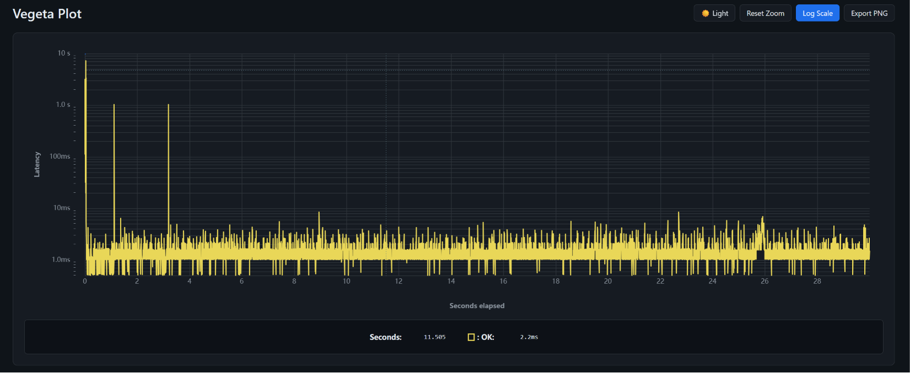
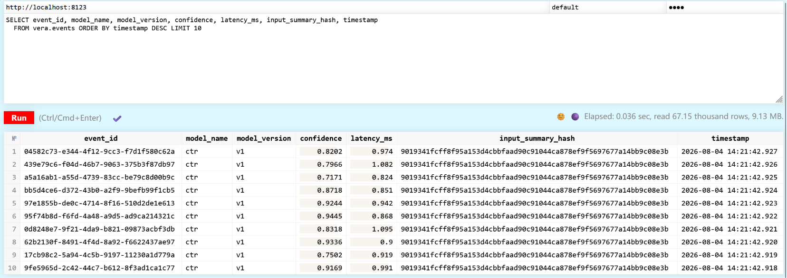

[](README.md) [](README.zh-CN.md)

# Vera

## Open-source AI Observability & Reliability Platform

Vera is an open-source observability platform for production AI systems.

It provides a zero-intrusion gateway to collect inference signals, detect model behavior changes, analyze root causes, and build a foundation for reliable AI operations.

Vera helps answer:

> Why did my AI system become worse?

Whether it is caused by data distribution changes, model degradation, prompt changes, retrieval issues, or infrastructure failures, Vera aims to provide visibility and automated response for production AI workloads.

---

## Highlights

- **Zero-code integration**
  - HTTP reverse proxy gateway intercepts inference traffic without modifying existing applications.
  - Asynchronous event collection avoids blocking inference requests.

- **Privacy-first by design**
  - Raw user data never leaves the process by default.
  - Only summaries and SHA-256 hashes are collected.
  - Configurable privacy masking levels.

- **High-throughput event pipeline**
  - Batch compressed event ingestion into ClickHouse.
  - Designed for large-scale OLAP analysis and real-time detection.

- **Built-in drift detection**
  - KS test and PSI based drift engine over event signals.
  - Webhook alerting and a live Streamlit dashboard.

- **Enterprise-ready architecture**
  - Self-hosted deployment.
  - Docker Compose local environment.
  - Kubernetes deployment planned.

---

# Architecture

```text
                         AI Applications

        ┌──────────────┬──────────────┬──────────────┐
        │ ML Models    │ LLM Services │ AI Agents    │
        └──────┬───────┴──────┬───────┴──────┬───────┘
               │              │              │

               ▼              ▼              ▼

                    ┌────────────────┐
                    │ Vera Gateway   │
                    │ (Go Proxy)     │
                    │ Event Capture  │
                    └───────┬────────┘

                            ▼

                    ┌───────────────┐
                    │ ClickHouse    │
                    │ Event Store   │
                    └───────┬───────┘

                            ▼

        ┌───────────────────┴───────────────────┐
        │                                       │
        ▼                                       ▼

┌───────────────┐                    ┌────────────────┐
│ Detection     │                    │ Root Cause     │
│ Engine        │                    │ Analysis       │
└───────┬───────┘                    └───────┬────────┘

        ▼                                    ▼

              Dashboard / Alerting / Mitigation
```

---

# Current Status

The end-to-end pipeline is already working:

```text
Gateway
   ↓
Event Collection
   ↓
ClickHouse Storage
   ↓
Drift Detection → Dashboard & Alerts
```

Verified:

* SHA-256 based privacy protection enabled by default
* gzip batch encoding
* Failed event retry mechanism
* ClickHouse authentication support
* Drift detection engine (KS test / PSI) with webhook alerting
* Streamlit dashboard for live metrics and drift status
* Docker Compose based integration testing

Current development focus:

* Python SDK
* Embedding drift detection
* Root cause analysis
* LLM observability support
* Automated mitigation

See [Roadmap](#roadmap).

---

# Benchmarks

Gateway benchmarks (2026-08):

| Benchmark             | Latency     | Note                                      |
| --------------------- | ----------- | ----------------------------------------- |
| `BenchmarkHandler`    | 120.7µs/op  | Full proxy path, including event collection |
| `BenchmarkBuildEvent` | 2.2µs/op    | Event collection overhead only            |

Load tests (vegeta, see `tools/loadtest`):

| Scenario | Rate       | Duration | Requests | Success | p99   | Event loss |
| -------- | ---------- | -------- | -------- | ------- | ----- | ---------- |
| A        | 200 req/s  | 30s      | 6,000    | 100%    | 2.4ms | 0          |
| B        | 1000 req/s | 30s      | 30,000   | 100%    | 3.6ms | 0          |



---

# Components

| Path                   | Description                                                            | Status      |
| ---------------------- | ---------------------------------------------------------------------- | ----------- |
| `services/gateway`     | Go inference gateway: proxy + event collection + async ClickHouse sink | ✅ Available |
| `services/detector`    | Drift detection engine (KS test / PSI on event signals)                | ✅ Available |
| `services/dashboard`   | Bilingual (EN/中文) Streamlit dashboard: metrics, charts and drift alerts | ✅ Available |
| `tools/simulator`      | Mock model service and traffic generator                               | ✅ Available |
| `infra/docker-compose` | Local development environment                                          | ✅ Available |
| `sdk/python`           | Python SDK for application-level signals                               | 🚧 Planned  |
| `services/rootcause`   | Root cause analysis engine                                             | 🚧 Planned  |
| `charts/helm`          | Kubernetes deployment templates                                        | 🚧 Planned  |

---

# Quick Start

Prerequisites:

* Docker
* Docker Compose

Start Vera:

```bash
docker compose -f infra/docker-compose/docker-compose.yml up --build
```

This starts:

* `gateway` - AI inference gateway
* `model-mock` - simulated model service
* `loadgen` - traffic generator
* `clickhouse` - event storage
* `detector` - drift detection engine
* `dashboard` - Streamlit dashboard at http://localhost:8501

Test inference:

```bash
curl -s -X POST http://localhost:8080/v1/predict \
  -H "Content-Type: application/json" \
  -H "X-Model-Name: ctr" \
  -H "X-Model-Version: v1" \
  -H "X-Client-ID: demo" \
  -d '{"price":42.5,"user_history_len":88,"item_rating":4.2,"is_new_user":0,"hour":14}'
```

Query collected events:

```bash
curl -s "http://localhost:8123/?query=SELECT%20count(*)%20FROM%20vera.events%20FORMAT%20CSV"
```

---

# Event Model

Each inference request generates an observability event.

Important fields:

| Field                | Description                 |
| -------------------- | --------------------------- |
| `event_id`           | Unique event identifier     |
| `request_id`         | Request tracing ID          |
| `model_name`         | Model identifier            |
| `model_version`      | Model version               |
| `input_summary_hash` | SHA-256 request fingerprint |
| `prediction`         | Model output                |
| `confidence`         | Confidence score            |
| `latency_ms`         | Request latency             |
| `privacy_mask_level` | none / partial / full       |
| `label`              | Optional delayed feedback   |



Events are uploaded asynchronously.

The inference path is never blocked by storage failures.

---

# Drift Detection

The detector (`services/detector`) periodically compares the current event window against a baseline window and flags signals whose distribution has shifted:

| Signal        | Test  |
| ------------- | ----- |
| `prediction`  | PSI   |
| `confidence`  | KS    |
| `latency_ms`  | KS    |

A signal is drifted when its score crosses the threshold. Results are stored in `vera.drift_results` and shown on the dashboard. Window sizes and thresholds are configurable via environment variables (see `infra/docker-compose/docker-compose.yml`).

Drifted signals trigger alerts to a Slack-compatible webhook (`ALERT_WEBHOOK_URL`).

## Drift Demo

Start the stack with drift simulation — the mock model shifts its output distribution 60 seconds after startup:

```bash
docker compose -f infra/docker-compose/docker-compose.yml \
  -f infra/docker-compose/docker-compose.drift-demo.yml up --build
```

Open http://localhost:8501: within a few minutes the drifted signals turn red on the dashboard.

Query drift results directly:

```bash
curl -s -u default:vera "http://localhost:8123/?query=SELECT+metric,score,threshold,drifted+FROM+vera.drift_results+ORDER+BY+timestamp+DESC+FORMAT+CSV"
```

Reset the environment afterwards:

```bash
docker compose -f infra/docker-compose/docker-compose.yml down -v
```

---

# Directory Structure

```text
services/gateway       # Go gateway (proxy + event collection + ClickHouse sink)
services/detector      # Drift detection engine
services/dashboard     # Streamlit dashboard
sdk/python             # Python SDK
services/rootcause     # Root cause analysis
tools/simulator        # Mock model + traffic generator
tools/loadtest         # Load testing configuration
infra/docker-compose   # Local deployment
charts/helm            # Kubernetes deployment
```

---

# Roadmap

## Phase 1: Core Observability

* [x] Gateway based collection
* [x] ClickHouse event storage
* [x] Local deployment environment

## Phase 2: AI Reliability

* [x] Data drift detection
* [x] Alerting system
* [ ] Python SDK
* [ ] Embedding drift detection
* [ ] Root cause analysis

## Phase 3: LLM & Agent Observability

* [ ] Prompt drift detection
* [ ] Token-level sampling
* [ ] Tool-call tracing
* [ ] Agent workflow monitoring
* [ ] RAG quality analysis

## Phase 4: Automated Recovery

* [ ] Model fallback
* [ ] Traffic routing
* [ ] Policy-based mitigation
* [ ] Self-healing AI workflows

---

# Why Vera?

Modern AI systems are becoming increasingly complex:

```text
User
 |
Agent
 |
Planner
 |
Tools
 |
RAG
 |
LLM
 |
Response
```

When something fails, traditional logging is not enough.

Teams need to understand:

* What changed?
* Where did it fail?
* Why did it fail?
* How can it recover?

Vera aims to become the reliability layer for production AI systems.

---

# License

Apache License 2.0

